E-Learning Platform called LeanOnline

## Overview
The E-Learning Platform is a web-based solution designed to help students access and manage their learning resources online. It aims to simplify the process of enrolling in courses, accessing course materials, and tracking learning progress. The platform provides an interactive and user-friendly interface for both students and educators.

## Team Members

- Mohamed Bashir Ali
- Abdullahi Abdirashid Osman

## Problem Statement

Traditional learning methods often lack accessibility and scalability, making it challenging for students to learn at their own pace. Additionally, managing and accessing course content can be cumbersome for both educators and students in a physical setup.

## Solution

Our E-Learning Platform addresses these challenges by providing an online system where users can easily explore courses, enroll, and access course materials anytime, anywhere. The platform enhances the learning experience with dynamic content delivery and a responsive design, ensuring it works seamlessly on various devices.

## Technologies Used

HTML: Used for creating the structure of the web pages, including course lists, details, and dashboard sections.
CSS: Applied for styling and layout, ensuring an appealing and responsive user interface.
JavaScript: Powers the dynamic functionalities, such as navigation, course enrollment, and dashboard interactions.
API Integration: Fetches course-related data dynamically to enhance the user experience and ensure up-to-date content availability.

## Key Features

Dynamic Content: The platform uses JavaScript to manipulate the DOM, enabling users to navigate seamlessly between courses and dashboards without refreshing the page.
API Integration: Incorporates APIs to fetch and display course data dynamically, ensuring that users always see the latest content.
Local Storage: Implements local storage to save enrolled courses and user progress, providing a persistent and personalized experience even after closing the browser.

## Home page

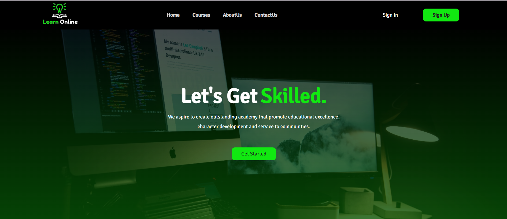

## courses page

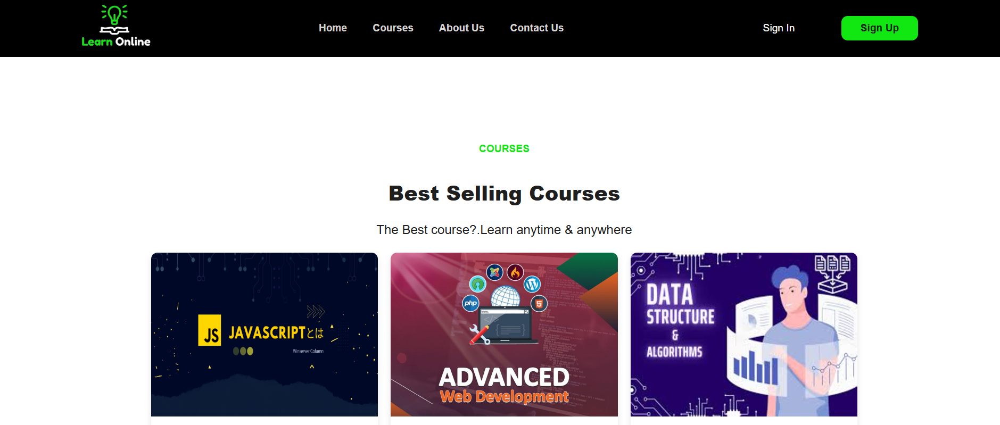

## About us page 

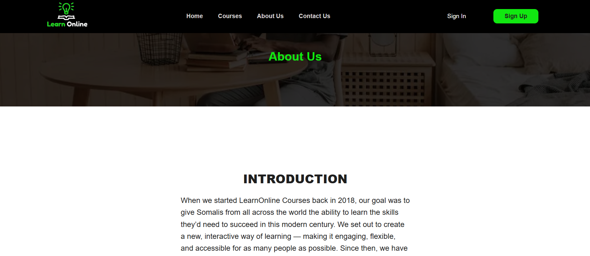

## Contact us page

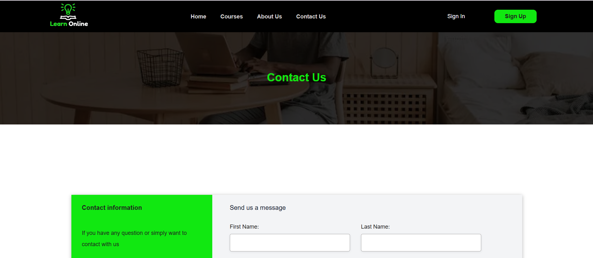
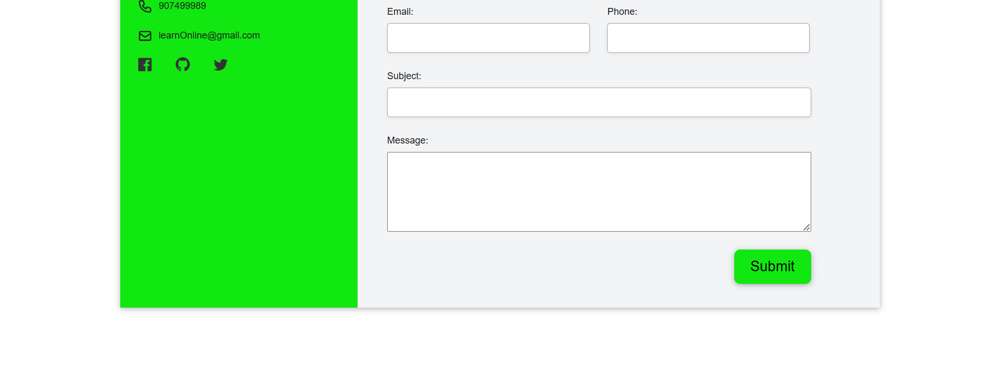

## User registeration page 

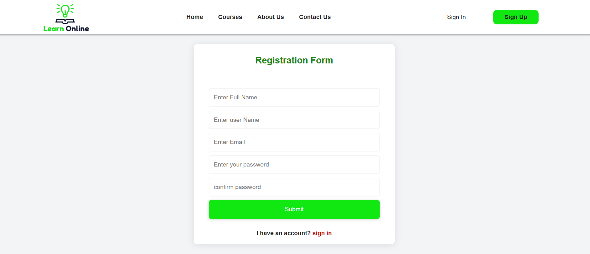

## Login 

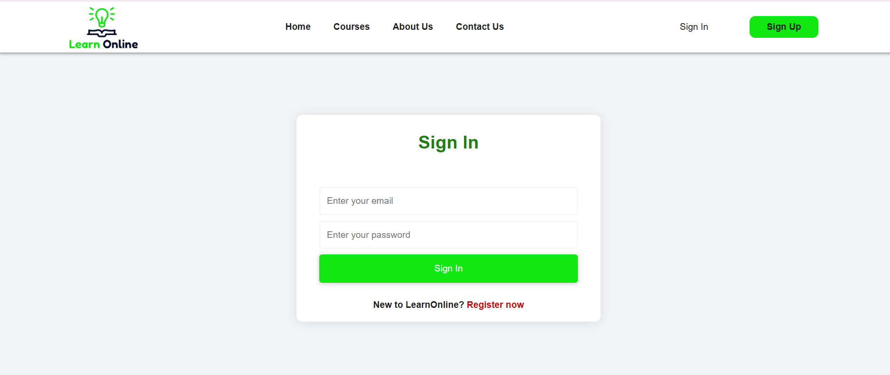

## Course details 

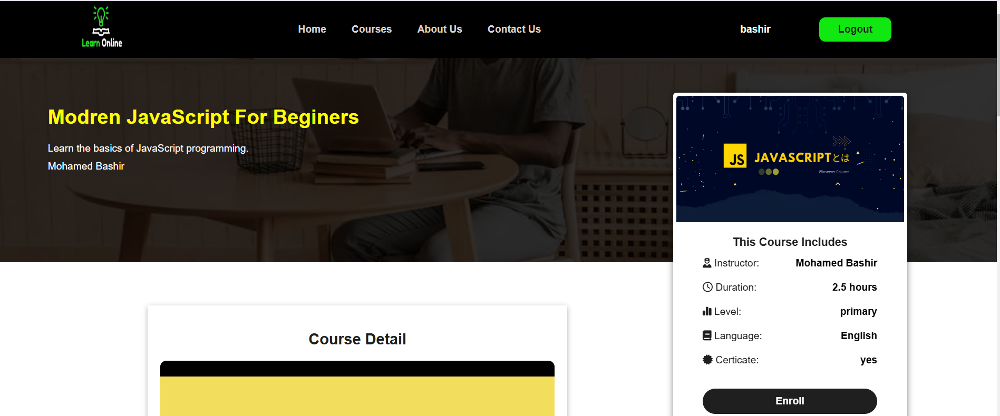

## Payment Modal 

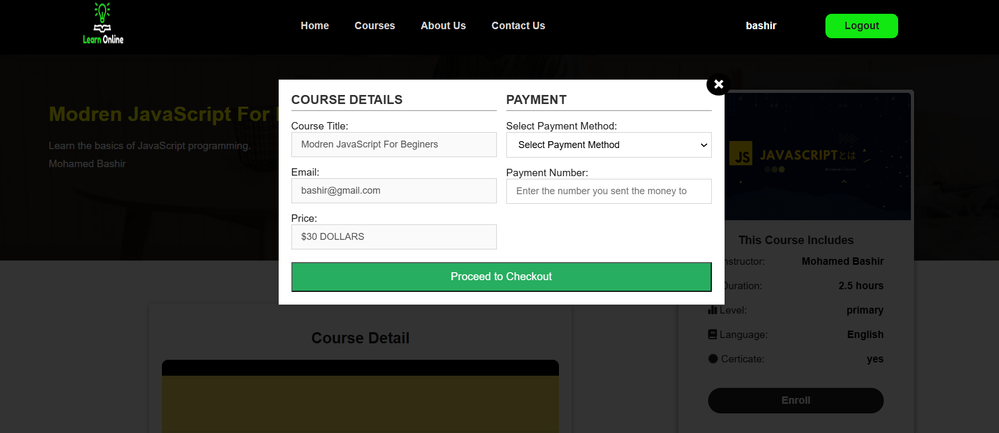

## Watching courses 

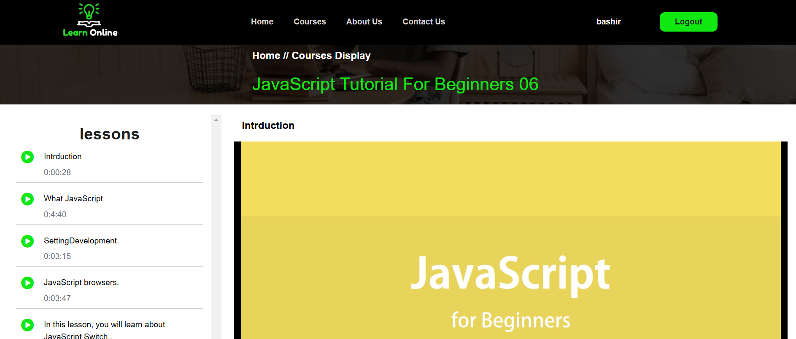

## Mycourses 

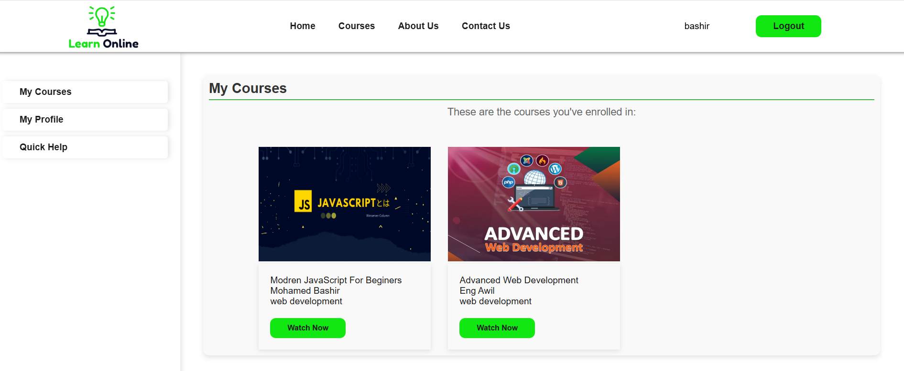

## My Profile 

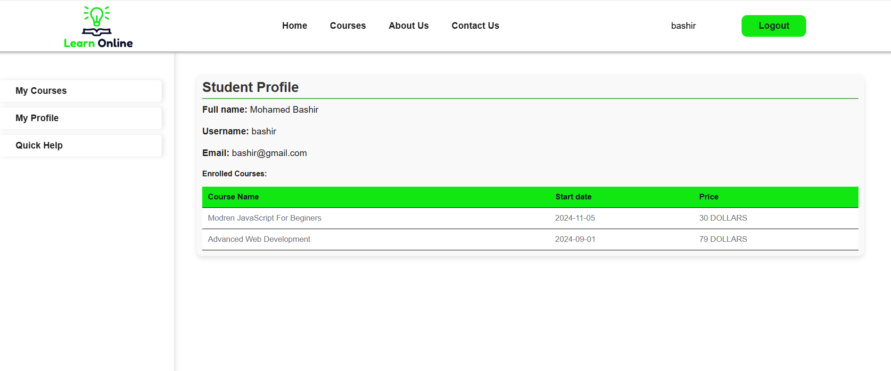

## Quick help

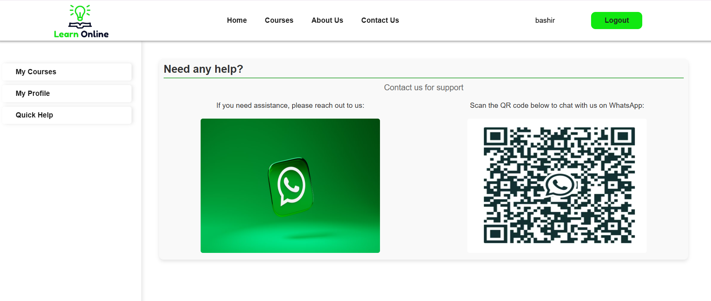

## Tablet view

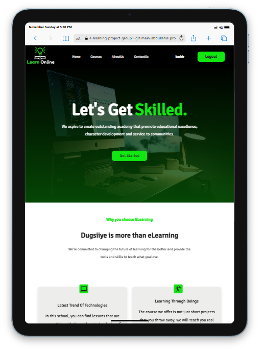

## Mobile view 

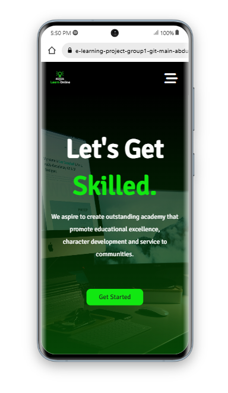

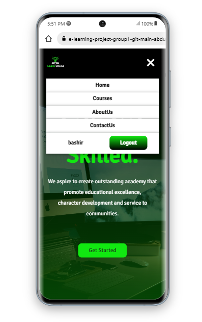